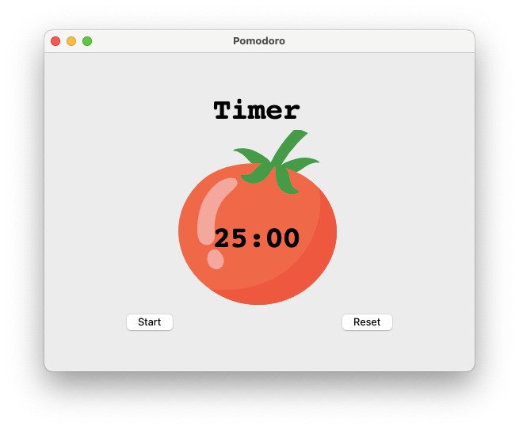

# Python Studies


This repository is dedicated to my studies and practices with the Python programming language. Here you will find various scripts, projects, and exercises that I am developing while learning more about Python.

## Table of Contents

- [About](#about)
- [Projects](#projects)
- [Installation](#installation)
- [Usage](#usage)
- [Contributing](#contributing)
- [License](#license)

## About

This repository contains a collection of Python scripts and projects that I have created to enhance my understanding and skills in Python. Each directory or script includes a README or comments explaining its purpose and how it works.

## Projects

Here are some of the key projects in this repository:

### Pomodoro
Description: A timer for productivity, using tkinter


You can find the project [here](28-pomodoro).

### Spotify Playlist
Description: Chose a specific date and the program will search for the top 100 musics most popular in that date using the billboard website.
This program create a playlist in your spotify profile with the top 100 musics, for this you have to creat an account in spotify's API and change your credentials in the [Code](46-spotifyPlaylist).

### example: YYYY-MM-DD date:2021-04-14


### Result in the spotify: 


### Amazon Price Tracker:
Description: An automation that search for the price of the url product that you provided and send an email if the price is equal or lower than the target price.
code [Here](47-PriceTracker)


You need to change the url product, your email, password, and the target price.


## Installation


To get started with the scripts in this repository, you can clone the repository using the following command:

```bash
git clone https://github.com/MarcosBrun0/Python-Studies.git
```

Ensure you have Python 3.8 or higher installed on your machine. You can check your Python version with:

```
python --version
```


## Usage

Each script or project in this repository is self-contained and can be run independently. Navigate to the directory of the script or project you want to run and execute it using Python:

```
python script_name.py
```

Refer to individual README files or comments within the scripts for specific usage instructions.

this repository is under construction, so may you see a lot of things missing.

## Contributing

Contributions are welcome! If you would like to contribute to this repository, please follow these steps:

1. Fork the repository
2. Create a new branch (`git checkout -b feature-branch`)
3. Make your changes
4. Commit your changes (`git commit -m 'Add some feature'`)
5. Push to the branch (`git push origin feature-branch`)
6. Open a pull request

## License

This repository is licensed under the MIT License. See the [LICENSE](LICENSE) file for more details.
